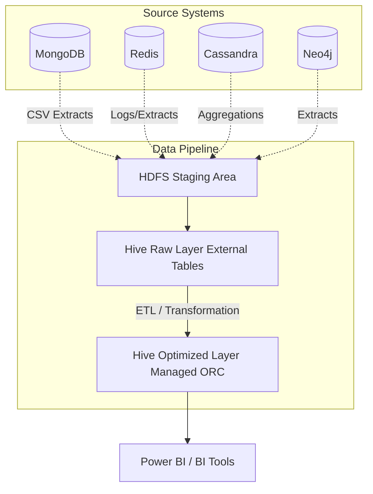

# System Architecture

## Overview
The ecommerce data platform leverages a polyglot persistence architecture to address the diverse scaling and query requirements of a modern e-commerce marketplace. By migrating away from a monolithic relational database, we can independently scale storage and compute for different data domains, ensuring high availability and low latency for transactional workloads while maintaining robust batch processing capabilities for analytics.

## Data Domains and Persistence Strategy

| Data Domain | Database Type | Technology | Justification |
| :--- | :--- | :--- | :--- |
| Product Catalogue | Document DB | MongoDB | Flexible schema for varying product attributes; fast read access. |
| User Sessions & Carts | Key-Value Store | Redis | In-memory performance for ephemeral, high-frequency read/write data. |
| Referral Programme | Graph DB | Neo4j | Optimized for querying complex, deeply nested relationship data. |
| Rider GPS Tracking | Column-Family | Cassandra | Exceptional write throughput for continuous, high-volume time-series telemetry. |
| Sales Analytics | Data Warehouse | Apache Hive (HDFS) | Highly scalable batch processing and analytics on massive datasets. |

## Data Flow

Data flows from the various operational source systems into a centralized analytical data warehouse for business intelligence.

1.  **Source Systems:** Application servers interacting with MongoDB, Redis, Neo4j, and Cassandra.
2.  **HDFS Staging:** Periodic extracts (e.g., CSV dumps from MongoDB) land in HDFS (e.g., `/staging/orders/`).
3.  **Hive Raw Layer:** External tables (`orders_raw`) provide immediate schema-on-read access to the staged files.
4.  **Hive Optimized Layer:** ETL processes transform the raw data, applying partitioning, bucketing, and converting to ORC format (`orders_opt`) for efficient querying.
5.  **BI Integration:** Tools like Power BI connect to Hive via JDBC/ODBC to build dashboards and reports.

## Infrastructure

The infrastructure is distributed across two primary data centers to ensure disaster recovery and high availability:
- **Primary Data Center:** Phnom Penh (Active)
- **Secondary Data Center:** Siem Reap (Passive/Disaster Recovery)

### Network Partition Considerations
Given potential network instability between regions, distributed systems like Cassandra are configured with appropriate replication strategies (e.g., `NetworkTopologyStrategy`) to tolerate temporary partitions while ensuring eventual consistency.

## Scalability Considerations
-   **MongoDB:** Sharding will be implemented based on product categories if the catalogue size exceeds single-node capacity.
-   **Cassandra:** Linearly scalable by adding more nodes to the ring as the rider fleet grows.
-   **Hive/HDFS:** Storage scales seamlessly by adding DataNodes; compute scales by adding NodeManagers to the YARN cluster.
